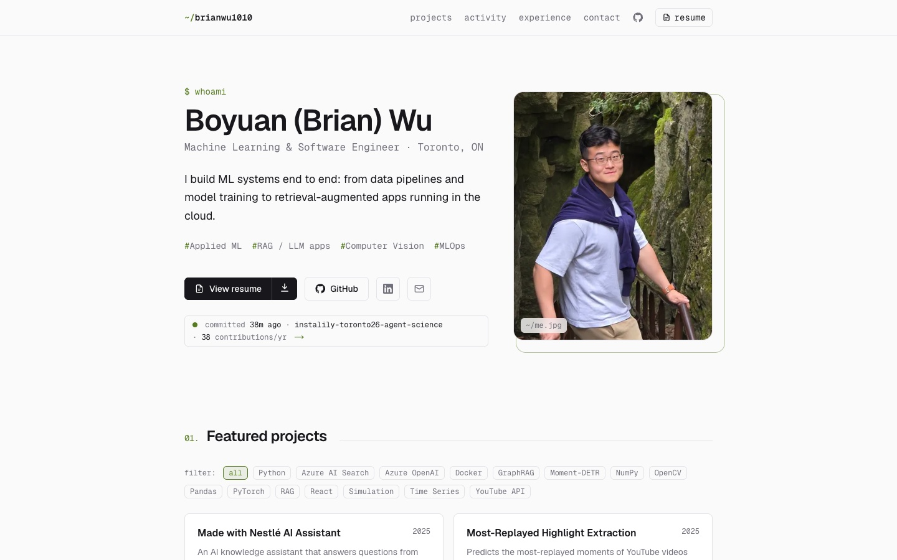
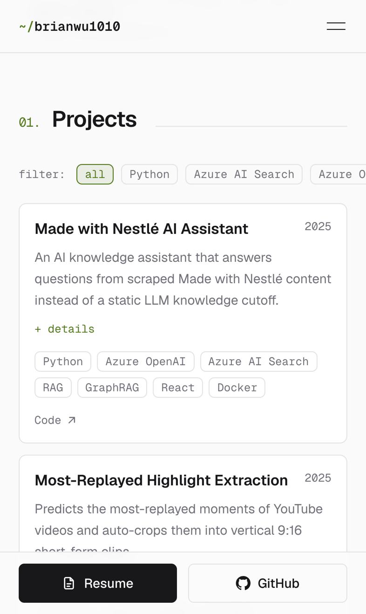
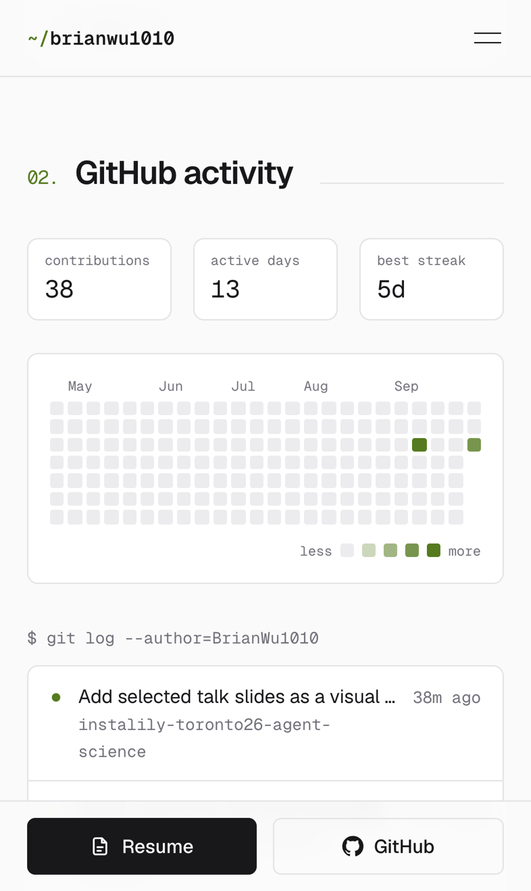
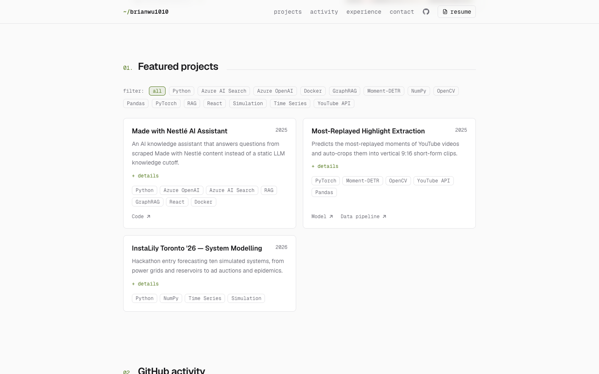
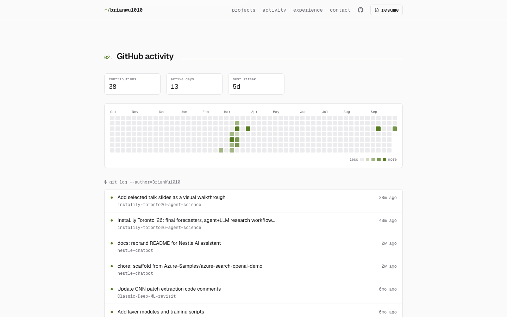
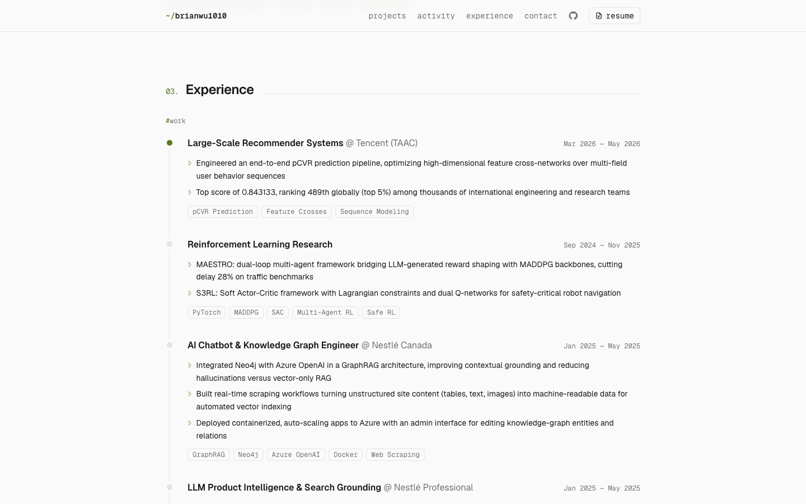

# Personal Website

Developer portfolio for Boyuan (Brian) Wu, built with Next.js 16 and Tailwind CSS v4, hosted on Vercel (Hobby plan).

**Live: [brianwu-portfolio.vercel.app](https://brianwu-portfolio.vercel.app)**

<a href="https://brianwu-portfolio.vercel.app">
  <picture>
    <source media="(prefers-color-scheme: dark)" srcset="docs/screenshots/desktop-top-dark.jpg">
    
  </picture>
</a>

### On a phone

Phones get their own layout: full-bleed photo, swipeable project filters and a sticky action bar.

<table>
  <tr>
    <td width="33%">
      <picture>
        <source media="(prefers-color-scheme: dark)" srcset="docs/screenshots/mobile-top-dark.jpg">
        
      </picture>
    </td>
    <td width="33%">
      <picture>
        <source media="(prefers-color-scheme: dark)" srcset="docs/screenshots/mobile-projects-dark.png">
        
      </picture>
    </td>
    <td width="33%">
      <picture>
        <source media="(prefers-color-scheme: dark)" srcset="docs/screenshots/mobile-activity-dark.png">
        
      </picture>
    </td>
  </tr>
</table>

### Sections

| Projects, filterable by tech stack | Live GitHub activity, refreshed hourly | Experience timeline |
| --- | --- | --- |
| <picture><source media="(prefers-color-scheme: dark)" srcset="docs/screenshots/desktop-projects-dark.png"></picture> | <picture><source media="(prefers-color-scheme: dark)" srcset="docs/screenshots/desktop-activity-dark.png"></picture> | <picture><source media="(prefers-color-scheme: dark)" srcset="docs/screenshots/desktop-experience-dark.png"></picture> |

## Run locally

```bash
npm install
npm run dev                # http://localhost:3000
git push                   # publish (Vercel deploys main automatically)
```

## Editing content

| What | Where |
| --- | --- |
| Name, tagline, links, projects, experience | `src/data/resume.ts` |
| Resume PDF | Vercel Blob, linked by `resumePdfSource` in `src/data/resume.ts` (see below) |
| Portrait photo | `src/assets/portrait.jpg` |
| Theme colors | CSS variables at the top of `src/app/globals.css` |

Every push to `main` on GitHub redeploys the site automatically.

### Updating the resume

The PDF is not in this repo. It lives in a public Vercel Blob store, and `/resume.pdf` is rewritten to it. To replace it:

```bash
npx vercel env pull .env.local     # once, to get BLOB_READ_WRITE_TOKEN
npx vercel blob put "Resume Boyuan Wu.pdf" --access public --pathname Boyuan-Wu-Resume.pdf \
  --rw-token "$(grep BLOB_READ_WRITE_TOKEN .env.local | cut -d= -f2- | tr -d '\"')"
```

Paste the printed URL into `resumePdfSource`, push, then delete the old file with `npx vercel blob del <old-url>`.

## How it works

- **Phone vs laptop layouts:** `src/proxy.ts` checks the user agent and serves `src/app/m/page.tsx` to phones and `src/app/page.tsx` to everyone else. Visitors can switch with the footer link, which sets a `layout` cookie.
- **GitHub activity:** `src/lib/github.ts` fetches the contribution calendar and recent commits from the GitHub GraphQL API, cached for one hour. It needs a `GITHUB_TOKEN` environment variable on Vercel (fine-grained token, public repositories, no permissions). Without it, the activity section is hidden.
- **Analytics:** Vercel Web Analytics is enabled; visits to `/resume` show how often the resume is viewed.

## Maintenance

- Renew the GitHub token before it expires, then update `GITHUB_TOKEN` in the Vercel project settings and redeploy (`npx vercel deploy --prod`, or push any commit).
- The README screenshots in `docs/screenshots/` are static; retake them after visual changes.
- Local dev with GitHub activity: `GITHUB_TOKEN=$(gh auth token) npm run dev`.
